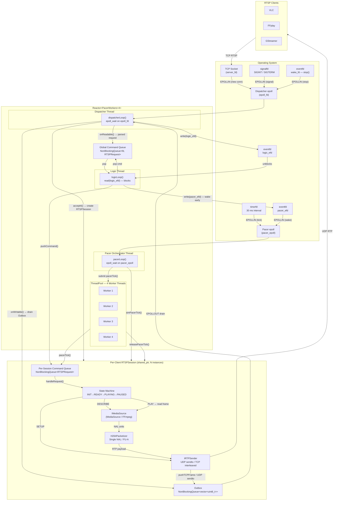
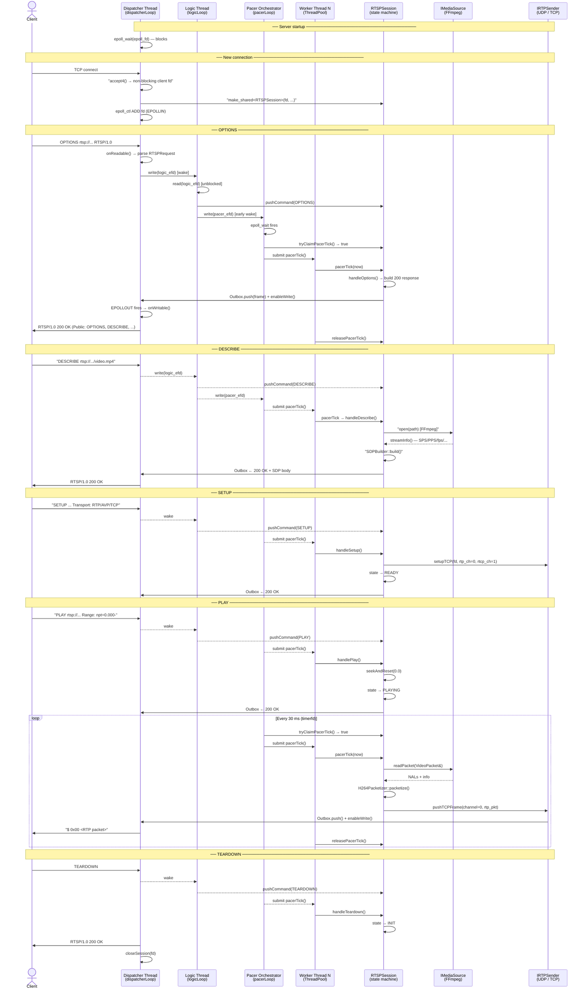

# RTSP Server

A production-grade, non-blocking C++20 RTSP/1.0 server built on the **Reactor** pattern.
Streams H.264 video over RTP to multiple simultaneous clients (VLC, FFplay, GStreamer, …).

### Key design decisions

- **Non-blocking Reactor** — a single `epoll`-driven Dispatcher thread handles all I/O events; no thread blocks on `recv`/`send`.
- **Three-thread pipeline** — Dispatcher (I/O) → Logic (routing) → Pacer Orchestrator (timing) cleanly separates concerns and eliminates lock contention on the hot path.
- **`timerfd`-driven pacing** — the 30 ms pacer clock is a kernel timer, not a `sleep()`, ensuring accurate frame scheduling without busy-waiting.
- **In-flight guard** — `tryClaimPacerTick()` / `releasePacerTick()` ensure exactly one worker runs `pacerTick()` per session per tick, preventing frame duplication when a worker takes longer than 30 ms.
- **`IMediaSource` / `IRTPSender` interfaces** — runtime-polymorphic interfaces enable unit-testing session logic with mock implementations without touching FFmpeg or the network stack.
- **CRTP `INalParser<Derived>`** — compile-time polymorphism for NAL splitting with zero virtual-dispatch overhead; the implementation is fully header-only. Its help to have zero copy parsing.
- **RAII FFmpeg handles** — `FormatCtxPtr`, `BSFCtxPtr`, `PacketPtr`, and `StreamView` in `FFmpegHandle.hpp` guarantee leak-free resource management even on error paths using the RAII.
- **Outbox high-watermark** — RTP frames are queued in a non-blocking outbox; if a slow client causes the outbox to exceed 5 MiB, the session is closed rather than blocking the Pacer.
- **Path-traversal prevention** — `std::filesystem::relative()` verifies that the resolved media path stays inside the media root before any file is opened.
- **Seamless looping** — on EOF, the RTP timestamp offset is advanced by `last_ts + last_frame_duration` so the client never sees a backward timestamp.

---

## Features

| Feature | Detail |
|---|---|
| RTSP methods | `OPTIONS`, `DESCRIBE`, `SETUP`, `PLAY`, `PAUSE`, `TEARDOWN` |
| Codec | H.264 (Baseline / Main / High) |
| Transport | RTP/AVP over UDP **and** RTP/AVP/TCP interleaved (RFC 2326 §10.12) |
| Audio | AAC / MPEG-4 audio via MPEG-4 AU headers |
| Looping | Seamless infinite loop with monotonically increasing RTP timestamps |
| Concurrency | Non-blocking Reactor — Dispatcher + Logic + Pacer Orchestrator threads |
| Session pacing | `timerfd`-driven 30 ms pacer with per-session in-flight guard |
| SDP | Auto-generated with `sprop-parameter-sets` from the live bitstream |
| Path security | Path-traversal attack prevention via `std::filesystem::relative()` |
| Interfaces | `IMediaSource` / `IRTPSender` — runtime-polymorphic, testable |
| CRTP NAL parser | `INalParser<Derived>` compile-time CRTP, header-only, zero overhead |
| RAII FFmpeg | All FFmpeg handles wrapped in `unique_ptr` custom deleters |
| Logging | Thread-safe timestamped logger with DEBUG/INFO/WARN/ERROR levels |
| Build | CMake 3.16+, FFmpeg via `pkg-config`, ASan/TSan options built-in |
| Tests | 64 Google Test unit cases + Python functional test suite |
| CI | GitHub Actions — ASan build, TSan build, functional tests |
| Docker | Multi-stage Dockerfile + docker-compose |

---

## Architecture

### Module overview

```
include/rtspserver/          src/
├── media/                   ├── media/
│   ├── IMediaSource.hpp     │   └── MediaSource.cpp   (FFmpeg demuxer)
│   ├── MediaSource.hpp      │
│   ├── AnnexBParser.hpp     │   ← header-only (CRTP INalParser<Derived>)
│   └── FFmpegHandle.hpp     │   ← RAII wrappers: FormatCtxPtr, BSFCtxPtr …
├── rtp/                     ├── rtp/
│   ├── IRTPSender.hpp       │   ├── RTPSender.cpp
│   ├── RTPSender.hpp        │   ├── RTPPacket.cpp
│   ├── RTPPacket.hpp        │   └── H264Packetizer.cpp
│   └── H264Packetizer.hpp   │
├── rtsp/                    ├── rtsp/
│   ├── RTSPRequest.hpp      │   ├── RTSPRequest.cpp
│   └── RTSPResponse.hpp     │   └── RTSPResponse.cpp
├── sdp/                     ├── sdp/
│   └── SDPBuilder.hpp       │   └── SDPBuilder.cpp
├── server/                  ├── server/
│   ├── Reactor.hpp          │   ├── Reactor.cpp
│   └── RTSPSession.hpp      │   └── RTSPSession.cpp
└── utils/                   └── utils/
    ├── Logger.hpp               ├── StringUtils.cpp
    ├── StringUtils.hpp          └── …
    ├── NonBlockingQueue.hpp ← lock-free SPSC queue
    ├── ThreadPool.hpp       ← fixed-size worker pool
    └── UniqueFd.hpp         ← RAII file-descriptor wrapper
```

---

## Reactor Pattern — Architecture Diagram



---

## Reactor Flow Diagram




## Requirements

### Ubuntu 22.04 / 24.04

```bash
sudo apt-get install -y \
    build-essential cmake ninja-build pkg-config git \
    libavformat-dev libavcodec-dev libavutil-dev \
    libswscale-dev libswresample-dev
```

> Only H.264 video streams are supported.  Transcode other codecs first:
> ```bash
> ffmpeg -i input.avi -c:v libx264 -preset fast -c:a aac output.mp4
> ```

---

## Build

```bash
cmake -B build -DCMAKE_BUILD_TYPE=Release
cmake --build build --parallel
```

The binary is placed at `build/rtsp-server`.

### CMake options

| Option | Default | Effect |
|---|---|---|
| `USE_ASAN` | `OFF` | AddressSanitizer + leak detection |
| `USE_TSAN` | `OFF` | ThreadSanitizer (mutually exclusive with ASan) |
| `RTSP_USE_SPDLOG` | `OFF` | Replace built-in logger with spdlog |

---

## Usage

```
rtsp-server [<directory>] [<host:port>] [-v]

  <directory>   Root folder containing video files (default: $PWD)
  <host:port>   Bind address (default: 0.0.0.0:554)
  -v            Enable debug logging
```

### Examples

```bash
# Serve the current directory on the default port (554)
sudo ./build/rtsp-server

# Custom directory and port (no root required for port > 1024)
./build/rtsp-server /home/user/videos 0.0.0.0:8554

# Play with VLC
vlc rtsp://localhost:8554/sample.mp4

# Play with FFPLAY
ffplay rtsp://localhost:8554/sample.mp4

```

---

## Tests

### Unit tests (Google Test)

```bash
cd build && ctest --output-on-failure
# or run directly:
./build/test/unit_tests
```

64 tests across 7 suites:

| Suite | What is covered |
|---|---|
| `RTSPRequest` | OPTIONS / DESCRIBE / SETUP / PLAY parsing, malformed input edge cases |
| `RTPPacket` | Header encoding — version, marker bit, seq, timestamp, SSRC |
| `H264Packetizer` | Single NAL, FU-A fragmentation, header structure, re-assembly |
| `AnnexBParser` | Start-code detection, split view / split copy, 3-byte vs 4-byte codes |
| `BlockingQueue` | SPSC queue push/pop, try_pop, concurrent safety |
| `ThreadPool` | Task submission, shutdown ordering |

### Functional tests (Python)

```bash
# Build first, then:
python3 test/functional/test_rtsp_server.py
# or via pytest:
pytest test/functional/test_rtsp_server.py -v
```

Place an H.264 MP4 at `test/functional/sample.mp4` to enable the
media-dependent test cases (DESCRIBE SDP validation, full OPTIONS →
DESCRIBE → SETUP → PLAY → TEARDOWN happy path).

### CI (GitHub Actions)

The [unit_test.yml](.github/workflows/unit_test.yml) workflow runs on every
push (excluding feature/fix/hotfix branches) and on every pull request:

1. **ASan build** — `cmake -DUSE_ASAN=ON` → `ctest`
2. **TSan build** — `cmake -DUSE_TSAN=ON` → `ctest`
3. **Release build** → Python functional tests

---

## Docker

```bash
# Build image
docker build -t rtsp-server .

# Run (mount ./media as the video library, expose port 554)
docker run -d --name rtsp-server \
    -v "$(pwd)/media":/media:ro \
    -p 554:554 \
    rtsp-server

# Or with docker-compose
docker compose up -d
```

Stream:
```bash
vlc rtsp://<docker-host>:554/video.mp4
```

---

## Limitations / Future Work

* RTCP Sender Reports (timestamps, etc.) are not emitted (stream still plays in VLC / FFplay without them). So Seek  function also not supported
* UDP transport supports IPv4 only.
* No authentication or access control.
* TLS / RTSPS not supported.
* VLC has aprox. 10 seconds buffering delay at the beginning, this is related with vlc behaviour, ffplay does not have same issue. 

